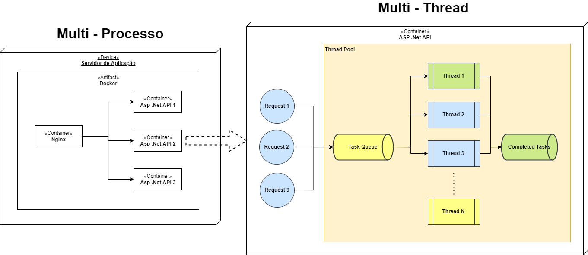

#  Bravo Challenge


## Objetivo e Estratégia

Este repositório implementa o desafio Bravo proposto em [[English](README.en.md) | [Portuguese](README.pt.md)]. O Objetivo central é implementar a API de conversão de moedas capaz de realizar o desempenho de 10000 requisições por segundo.

Para tal, a Arquitetura do projeto se faz em uma aplicação Web no padrão MVC, e para atinigir o nível de performance desejado, foram utilzido o conceito de **paralelismo** de processamento. O paralelismo pode ser feito em camadas, nesse projeto duas dessas foram exploradas, a camada de **threads** e de **processos**. Portanto, a arquitetura foi implementada de forma a ser capaz de realizar tarefas multi-thread e multi-processo, conforme descrito:

1. Para realizar processamento multi-thread, fui utilizado o padrão de design [https://en.wikipedia.org/wiki/Thread_pool](*Thread Pool*), distribuindo as requisições como tarefas a ser executadas entre as threads alocadas;
2. Para o Multi-Processo, foram abertos cópias do processo da aplição e as requisições são distribuidas por uma aplicação chamada **Load Balancer** que faz os balanceamento da carga das aplicações entre os processos.

 A figura abaixo mostra a arquitetura do projeto. Para implementar 1. foi escolhido usar a linguagem **C#** com o framework **ASP.NET Core 6.0** para implementar uma aplicação Web API. Devido a praticidade e a possibilidade de otimização de performance. O ASP.NET é netarualmente construido com base em uma estrutura de Thread Pool, direcionando as requisções no padrão MVC entre threads alocadas. A premissa 2. foi alcançada utilizando duas tecnologias: O **Docker**, no qual nos permite subir containeres de aplicações e o **Nginx**, capaz de gerenciar servidores web. Através do Docker pode-se subir containeres do Nginx e das cópias da aplicação da API, o Nginx foi utilizado como proxy reverso e balanceador de carga entre as aplicações.



## Rodando o Projeto

O projeto sobe uma aplicação Web API com documentação em uma página [Swagger](https://swagger.io) para fins de uso. O ambiente é executado em containeres de Docker, para subir basta executar o Docker Compose. Beixe o projeto e execute na pasta raiz (onde se encotra o *docker-compose.yaml*):

```` bash
    docker-compose up -d --build
````

Para testar a API pode-se utilizar o *curl* na rota

```` bash
    curl -X 'GET' \
        'http://localhost:5100/currency/convert?from=USD&to=BRL&amount=1' \
        -H 'accept: text/plain'
````

A API se encotra documentada em uma página swagger basta acessar o link:

````
    http://localhost:5100/swagger/index.html
````

## Estrutura do Projeto

O Projeto conta com uma aplicação Web API para servir a conversão de moedas descrita no desafio, camada de dados e acesso, além de testes de unidade e performance, conforme descrito:

- Web-Api (Implementado)
- DataAccess (Parcialmente)
- Data (Implementado)
- Benchmark (Implementado)
- Test (Parcialmente)

O projeto inicialmente contaria com um containere de uma instância de banco MS SQL Server, porém para fins de simplicidade os dados persistentes foram salvos em arquivo, o projeto DataAccess acessa esses dados, porém sua implentação para o SQL server está em construção. O Projeto de Benchmark testa a performance da API, assim como o projeto de Testes lida com testes Unitários utilizando XUnit. O projeto de Dados implementa os modelos de dados utilizados nos projetos.

## Benchmark

Foram testadas a aplicação a nível de Thread e Thread e processo. Para testar a nível de thread foi utilizado a biblioteca [BenchmarkDotnet](https://benchmarkdotnet.org/index.html) e para Thread e processos [Artillery.](https://www.artillery.io/).

A biblioteca BenchmarkDotNet é uma biblioteca .NET leve, de código aberto e poderosa que pode transformar seus métodos em benchmarks, rastrear esses métodos e, em seguida, fornecer insights sobre os dados de desempenho capturados. Usando esta biblioteca fica mais fácil escrever benchmarks e os resultados do processo de benchmarking também são fáceis de usar. Assim você pode usar essa biblioteca para realizar testes de avaliação de desempenho de novas funcionalidades ou de novas implementações comparando-as com as anteriores.

O Teste foi feito com 100 iterações com 1000 requisições abertas simultaneamente, os resultados podem ser reproduziods e encotrados [nessa pasta](./Benchmark/bin/Release/net6.0/BenchmarkDotNet.Artifacts).

````bash
BenchmarkDotNet=v0.13.1, OS=Windows 10.0.19044.1889 (21H2)
Intel Core i7-8565U CPU 1.80GHz (Whiskey Lake), 1 CPU, 8 logical and 4 physical cores
.NET SDK=6.0.400
  [Host] : .NET 6.0.8 (6.0.822.36306), X64 RyuJIT  [AttachedDebugger]
  Dry    : .NET 6.0.8 (6.0.822.36306), X64 RyuJIT


|     Mean |   StdErr |   StdDev |      Min |       Q1 |   Median |       Q3 |        Max |  Op/s |
|---------:|---------:|---------:|---------:|---------:|---------:|---------:|-----------:|------:|
| 498.1 ms | 15.37 ms | 153.7 ms | 403.9 ms | 445.3 ms | 465.6 ms | 500.3 ms | 1,855.9 ms | 2.008 |
````

Para o teste completo com Artilley, foram criados 1000+ usuários enviando 1000+/sec requisições simultanemante durante 30 segundos. Os resultados podem ser reproduzidos no projeto [Load Test](./LoadTest/).

````bash

errors.ECONNREFUSED: ........................................................... 10034
errors.ETIMEDOUT: .............................................................. 284259
http.codes.200: ................................................................ 10481
http.request_rate: ............................................................. 497/sec
http.requests: ................................................................. 304545
http.response_time:
  min: ......................................................................... 47
  max: ......................................................................... 9779
  median: ...................................................................... 1587.9
  p95: ......................................................................... 7117
  p99: ......................................................................... 8868.4
http.responses: ................................................................ 10481
vusers.completed: .............................................................. 248
vusers.created: ................................................................ 294313
vusers.created_by_name.0: ...................................................... 294313
vusers.failed: ................................................................. 294293
````

## Requisitos Cumpridos

-   Forkar esse desafio e criar o seu projeto (ou workspace) usando a sua versão desse repositório, tão logo acabe o desafio, submeta um _pull request_.
-   O código precisa rodar em macOS ou Ubuntu (preferencialmente como container Docker)
-   Para executar o código, deve ser preciso apenas rodar os seguintes comandos:
    -   git clone https://github.com/fol21/challenge-bravo
    -   cd \challenge-bravo
    -   docker-compose up -d --build
-   A API foi escrita com ou sem a ajuda de _frameworks_
-   A API precisa suportar um volume de 1000 requisições por segundo em um teste de estresse.

